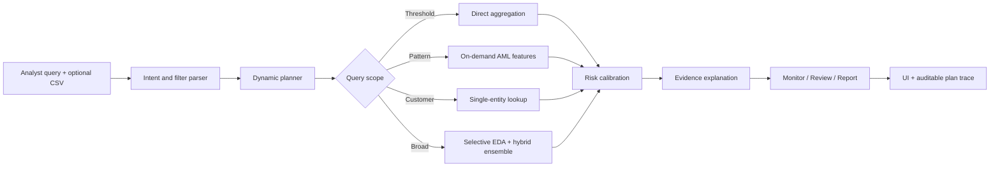

# CipherSAR

> An adaptive, explainable AML investigation agent for financial institutions.

CipherSAR turns a compliance analyst's natural-language question into a query-specific investigation plan. It selects only the tools needed for that request, detects suspicious activity with a hybrid rule/statistical ensemble, and returns defensible evidence, risk, confidence, and an escalation recommendation.

The interface is presented as an internal Financial Crime Compliance workspace for the fictional **Veyra Bank**. CipherSAR is decision-support software: every escalation requires human review.

## Operational workspace

The sidebar modules are fully functional:

- **Command center** runs natural-language AML investigations and exposes the dynamic tool trace.
- **Investigations** records completed runs and reopens their exact findings and plans.
- **Review queue** tracks pending, in-review, resolved, and reopened findings with audit events.
- **Customers** searches the active population and starts single-entity investigations.
- **Transactions** searches and filters activity, highlights linked evidence, and pivots to customer review.
- **Datasets** imports validated CSV data, reports coverage, and restores the deterministic demo dataset.
- **Audit trail** records investigation, review, dataset, policy, and system events.
- **Policy settings** changes the backend risk bands, escalation thresholds, and minimum report confidence for subsequent analysis.

## Why it exists

Traditional AML systems often create large alert volumes through static rules. Investigators then spend time dismissing false positives while sophisticated structuring, smurfing, layering, velocity, and rapid cash-out behavior can cross multiple rules or channels.

CipherSAR addresses that problem with:

- natural-language intent, entity, threshold, date, geography, segment, and transaction-type extraction;
- a dynamic planner that skips irrelevant work instead of running a fixed pipeline;
- on-demand AML feature engineering;
- hybrid deterministic and robust statistical detection;
- explainable 0–100 advisory risk scoring;
- evidence-linked `monitor`, `review`, or `report` recommendations;
- a visible execution trace showing what the agent ran, skipped, and why.

## Adaptive behavior

| Query | Plan chosen by CipherSAR |
| --- | --- |
| `Find structuring patterns in the last 30 days` | Filter by date, build structuring-only features, run the structuring detector, score, explain, recommend. Full EDA and unrelated velocity tools are skipped. |
| `Which customers made 10+ transactions under $10,000?` | Apply amount filters and direct aggregation. No ML/anomaly detector is invoked. |
| `Is customer ID 4521 suspicious?` | Resolve the entity, analyse only that customer's history, and explain its current evidence. Full-population EDA is skipped. |
| `Analyse this dataset for suspicious activity` | Run selective EDA, broad AML feature engineering, and the hybrid anomaly ensemble. |

Every API response contains `parsedQuery`, `plan.steps`, `plan.skippedTools`, `metrics`, `findings`, and model-governance safeguards.

## Detection approach

CipherSAR does **not require a pre-trained model or labelled SAR data**. It learns the current dataset baseline at analysis time.

1. **Rules** identify known AML typologies:
   - structuring near a reporting threshold;
   - distributed small deposits / smurfing;
   - rapid in/out wire flow / layering;
   - unusual transaction velocity;
   - rapid cash-out after incoming funds.
2. **Robust statistics** use median and median absolute deviation (MAD) to detect population-relative outliers without assuming a normal distribution.
3. **Risk calibration** combines independent evidence contributions into a capped 0–100 score.
4. **Explanation** preserves the underlying feature values and reasons that contributed to the score.
5. **Action policy** maps the evidence to `monitor`, `review`, or `report`, while retaining mandatory human approval.

This satisfies the challenge's ML/statistical/rule-based requirement while avoiding a misleading supervised model trained on synthetic labels.

## Architecture



The monorepo contains:

```text
apps/
  api/       Express API, agent planner, tools, detectors, synthetic dataset
  web/       React command center, CSV import, evidence export
packages/
  shared/    Shared TypeScript request/response contracts
docs/        Architecture, dataset schema, demo, and contribution guidance
docker/      Production container definitions
```

## Dataset

The repository includes a deterministic synthetic retail-banking generator with:

- 35 customers across retail and business segments;
- normal card, ACH, and wire activity;
- customer `CUS-4521`: repeated cash deposits close to $10,000;
- customer `CUS-3108`: distributed small cash deposits across branches;
- customer `CUS-8842`: fast inbound/outbound cross-border wire flows.

No real customer or financial data is included. See [Dataset schema](docs/DATASET.md) and the ready-to-import [demo CSV](data/demo-transactions.csv).

## Tech stack

- TypeScript with strict type checking
- React 19 + Vite
- Node.js + Express
- Zod request validation
- Vitest + Supertest
- Docker + Nginx
- GitHub Actions

The visual direction is derived from the repository's Superdesign design system: a high-contrast forensic command center with warm paper surfaces, ink typography, lime evidence accents, coral risk states, a persistent bank navigation shell, and clear human-control messaging.

## Local setup

Prerequisites: Node.js 20+ and npm 10+.

```bash
npm install
npm run dev
```

Open `http://localhost:5173`. The API runs on `http://localhost:4000`.

Useful commands:

```bash
npm test
npm run typecheck
npm run build
npm run dev:api
npm run dev:web
```

## Usage

### Command center

1. Open the dashboard.
2. Try one of the example compliance questions.
3. Inspect the parsed intent, invoked steps, and intentionally skipped tools.
4. Select a suspicious entity to inspect its evidence and score contributions.
5. Use **Import data** to analyse a CSV matching the documented schema.
6. Use **Export evidence** to download the current findings as JSON.

### API

Use the built-in synthetic dataset:

```bash
curl -X POST http://localhost:4000/api/investigations \
  -H "Content-Type: application/json" \
  -d '{"query":"Is customer ID 4521 suspicious?"}'
```

Analyse supplied data by adding `transactions` and, optionally, `customers` to the JSON body. The API validates a maximum of 100,000 records per collection.

Endpoints:

- `GET /api/health`
- `GET /api/examples`
- `GET /api/dataset/summary`
- `GET /api/dataset`
- `POST /api/investigations`

## Docker

```bash
docker compose up --build
```

Open `http://localhost:8080`. Nginx serves the web app and proxies `/api` to the API container.

## Testing

The automated suite covers:

- query parsing and entity/filter extraction;
- plan adaptation and tool skipping;
- pattern detectors and risk scoring;
- end-to-end agent behavior;
- API health, validation, and investigations.

CI runs install, strict type checks, all tests, and the production build on every push and pull request.

## Governance and limitations

- A flag is evidence for review, not proof of money laundering.
- Scores are advisory and must not autonomously file a SAR/STR.
- Thresholds require institution-, product-, jurisdiction-, and segment-specific calibration.
- A production deployment requires authentication, authorization, encryption, retention controls, monitoring, data-lineage controls, independent validation, and regulatory/legal review.
- Synthetic patterns demonstrate system behavior; they do not establish real-world precision or recall.

See [Architecture and controls](docs/ARCHITECTURE.md) for the production-hardening path.

## Data sources

- Transactions and customer records: deterministic synthetic data generated locally in `apps/api/src/data/sample-data.ts`.
- AML pattern definitions: implemented from the challenge brief's structuring, smurfing, and layering examples and commonly understood transaction-monitoring concepts.
- No external dataset, personal information, proprietary model, or third-party inference API is used.

## Contribution traceability

All work must be committed from the contributor's own GitHub account. Do not rewrite authorship or commit another person's work under their name.

- **Devesh Singhal** — repository owner and initial implementation.
- **Ankit Kumar** — collaborator; contributions should be made through a feature branch and pull request from `AnkitKumar61`.

See [CONTRIBUTING.md](CONTRIBUTING.md) and [Contribution workflow](docs/CONTRIBUTIONS.md).

## License

MIT — see [LICENSE](LICENSE).
